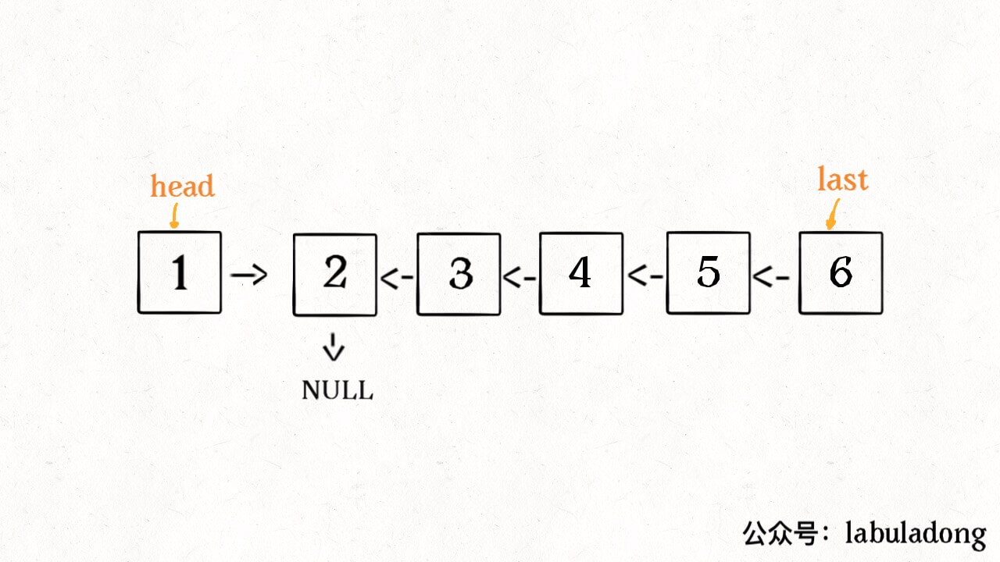
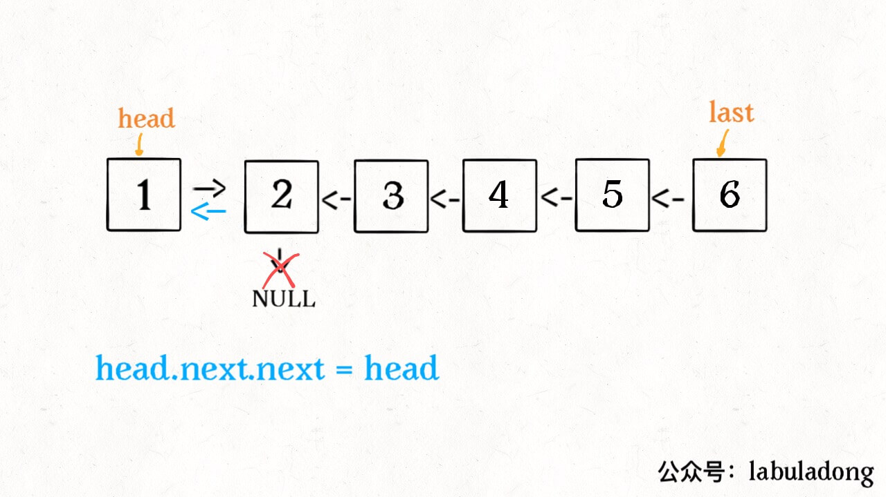

<!-- @import "[TOC]" {cmd="toc" depthFrom=1 depthTo=6 orderedList=false} -->

<!-- code_chunk_output -->

- [1. 六大解题套路 - 双指针](#1-六大解题套路-双指针)
  - [1) 合并两个有序链表](#1-合并两个有序链表)
  - [2) 合并 k 个有序链表](#2-合并-k-个有序链表)
  - [3) 寻找单链表的倒数第 k 个节点](#3-寻找单链表的倒数第-k-个节点)
  - [4) 寻找单链表的中点](#4-寻找单链表的中点)
  - [5) 判断单链表是否包含环并找出环起点](#5-判断单链表是否包含环并找出环起点)
  - [6) 判断两个单链表是否相交并找出交点](#6-判断两个单链表是否相交并找出交点)
  - [题目](#题目)
- [2. 反转链表](#2-反转链表)
  - [Recurison](#recurison)
    - [Code](#code)
      - [图解](#图解)
    - [反转链表前 N 个节点](#反转链表前-n-个节点)
    - [反转链表的一部分](#反转链表的一部分)
  - [Iterative](#iterative)
  - [题目](#题目-1)
- [3. Palindrome Linkedlist](#3-palindrome-linkedlist)

<!-- /code_chunk_output -->


# 1. 六大解题套路 - 双指针

## 1) 合并两个有序链表
- two pointers 比较大小
- dummy 节点：避免处理空指针

## 2) 合并 k 个有序链表
- 使用 heap :point_right: `Priority Queue`
  

## 3) 寻找单链表的倒数第 k 个节点
- 双指针，`p1` 走 k 步，`p2` 再走
- 要删除第 `n` 个点，需要找到 `n+1` :point_right: `(n + 1).next = n.next.next` 
- 加入 `dummy` 防止溢出：如果要删除正数第一个点，加入 `dummy` 可以有效防止溢出，因为可以找 `n + 1 == dummy`


## 4) 寻找单链表的中点
- 快慢指针

## 5) 判断单链表是否包含环并找出环起点
- 快慢指针：如果 `fast` 最终遇到空指针，说明链表中没有环；如果 `fast` 最终和 `slow` 相遇，那肯定是 `fast` 超过了 `slow` 一圈，说明链表中含有环。link


## 6) 判断两个单链表是否相交并找出交点
- 比较长度，是长度相等


## 题目
- [ ] :green_heart: 21
- [ ] :heart: 23 
- [ ] :green_heart: 141
- [ ] :yellow_heart: 142
- [ ] 876
- [ ] 19
- [ ] 160


# 2. 反转链表
## Recurison
- 对于递归算法，最重要的就是明确递归函数的定义
- `reverse()`: 输入一个节点 head，将「以 head 为起点」的链表反转，并返回反转之后的头结点。
  
### Code
``` java
ListNode reverse(ListNode head) {
    if (head == null || head.next == null) {
        return head; // 链表只有一个节点的时候反转也是它自己，直接返回。
    }
    ListNode last = reverse(head.next);
    head.next.next = head; 
    head.next = null; // 当链表递归反转之后，新的头结点是 last，而之前的 head 变成了最后一个节点，别忘了链表的末尾要指向 null：
    return last;
}
```
#### 图解





### 反转链表前 N 个节点
- 利用一个 parameter 记录 当前是第几个 node
- 需要 `successor` 记录初始 `head` 的下一位

``` java {highlight=[7,15]}
ListNode successor = null; // 后驱节点

// 反转以 head 为起点的 n 个节点，返回新的头结点
ListNode reverseN(ListNode head, int n) {
    if (n == 1) {
        // 记录第 n + 1 个节点
        successor = head.next;
        return head;
    }
    // 以 head.next 为起点，需要反转前 n - 1 个节点
    ListNode last = reverseN(head.next, n - 1);

    head.next.next = head;
    // 让反转之后的 head 节点和后面的节点连起来
    head.next = successor;
    return last;
}
```


### 反转链表的一部分
- 找到相对于 `m = 1` 的 `range` 起点
- 如果我们把 `head` 的索引视为 1，那么我们是想从第 `m` 个元素开始反转对吧；如果把 `head.next` 的索引视为 1 呢？那么相对于 `head.next`，反转的区间应该是从第 `m - 1` 个元素开始的；那么对于 `head.next.next` 呢
``` java
ListNode reverseBetween(ListNode head, int m, int n) {
    // base case
    if (m == 1) {
        return reverseN(head, n);
    }
    // 前进到反转的起点触发 base case
    head.next = reverseBetween(head.next, m - 1, n - 1);
    return head;
}
```

## Iterative

## 题目
- [ ] :green_heart: 206
- [ ] :yellow_heart: 92


# 3. Palindrome Linkedlist