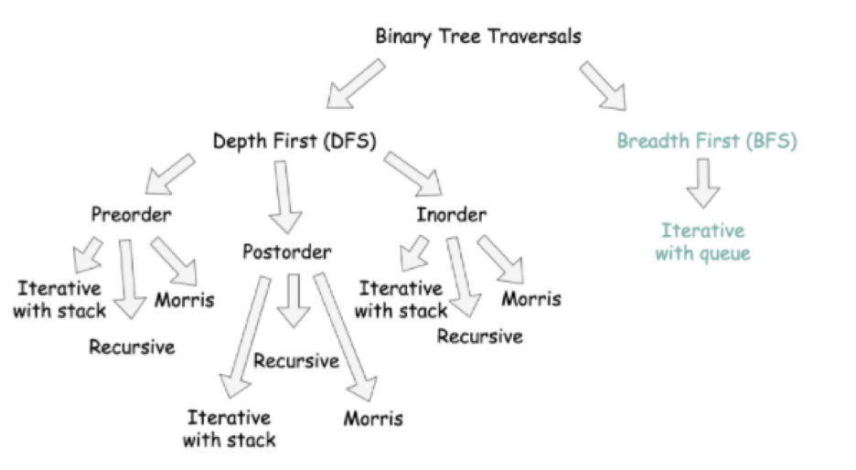
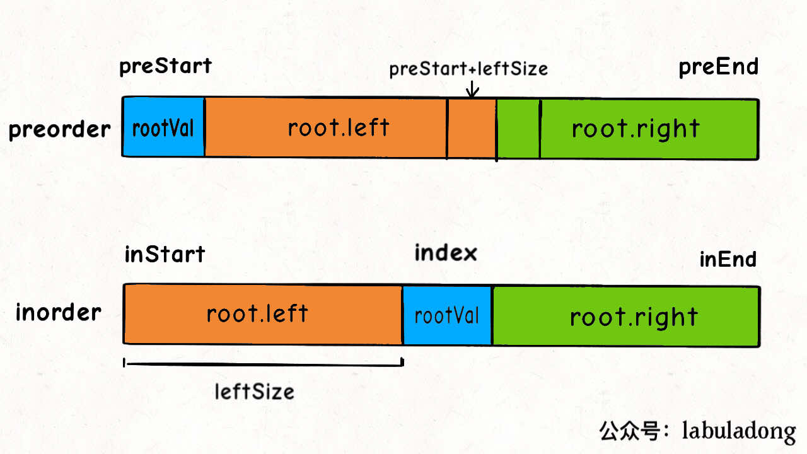
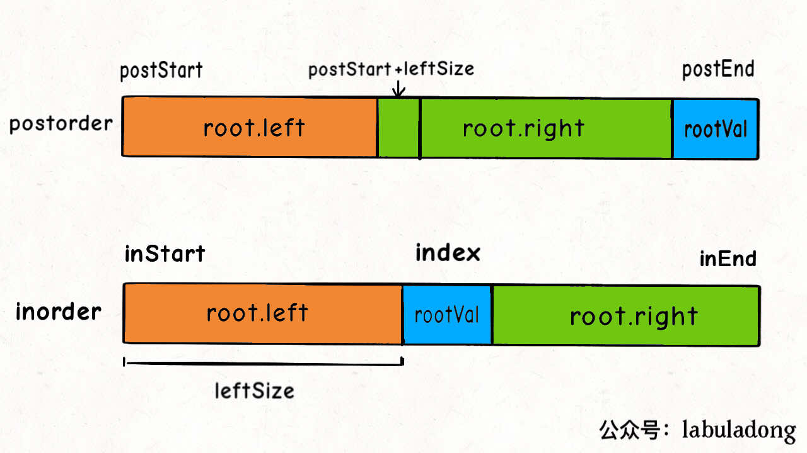
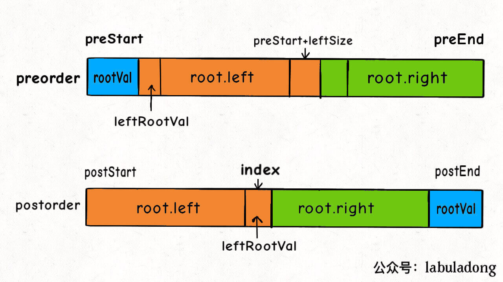

<!-- @import "[TOC]" {cmd="toc" depthFrom=1 depthTo=6 orderedList=false} -->

<!-- code_chunk_output -->

- [General Thinking Process](#general-thinking-process)
- [Binary Tree](#binary-tree)
  - [DFS](#dfs)
  - [BFS](#bfs)
    - [框架](#框架)
    - [双向bfs 优化](#双向bfs-优化)
  - [子树问题](#子树问题)
  - [Tricks](#tricks)
  - [题目](#题目)
    - [Answers](#answers)
- [Binary Search Tree](#binary-search-tree)
  - [题型](#题型)
    - [移除一个 node](#移除一个-node)
  - [题目](#题目-1)
- [Traverse](#traverse)
  - [框架 (recursive)](#框架-recursive)
    - [pre-order](#pre-order)
    - [in-order](#in-order)
    - [post-order](#post-order)
  - [层序遍历 (iterative) -- similar to BFS](#层序遍历-iterative-similar-to-bfs)

<!-- /code_chunk_output -->


# General Thinking Process
- binary tree的所有问题，就是让你在前中后序位置注入巧妙的代码逻辑，去达到自己的目的。
- :wavy_dash: <mark>**只需要思考每一个节点应该做什么**</mark>，其他的不用管，抛给binary tree遍历框架，recursion会对所有节点做相同的操作。
- 思考过程：
  - 是否可以通过遍历一遍二叉树得到答案？:point_right: *不使用额外的function*
  - 如果不能的话，是否可以定义一个递归函数，通过子问题（子树）的答案推导出原问题的答案？
- :o: <mark>**先搞清楚当前 root 节点「该做什么」以及「什么时候做」，然后根据函数定义递归调用子节点**</mark>
  - 「该做什么」:point_right: 想清楚写什么代码能够实现题目想要的效果
    - 当一个节点做不到，那就增加函数参数，安排两个节点
  - 「什么时候做」:point_right: 思考这段代码到底应该写在前序、中序还是后序遍历的代码位置上。





# Binary Tree

## DFS
- recursion
- stack
  - preorder: 先 push right, then left; pop() from last -> keep iterating over left subtrees
## BFS
- queue
  - while + for loop 

### 框架
``` java
// 计算从起点 start 到终点 target 的最近距离
int BFS(Node start, Node target) {
    Queue<Node> q; // 核心数据结构
    Set<Node> visited; // 避免走回头路
    
    q.offer(start); // 将起点加入队列
    visited.add(start);
    int step = 0; // 记录扩散的步数

    while (q not empty) {
        int sz = q.size();
        /* 将当前队列中的所有节点向四周扩散 */
        for (int i = 0; i < sz; i++) {
            Node cur = q.poll();
            /* 划重点：这里判断是否到达终点 */
            if (cur is target)
                return step;
            /* 将 cur 的相邻节点加入队列 */
            for (Node x : cur.adj()) {
                if (x not in visited) {
                    q.offer(x);
                    visited.add(x);
                }
            }
        }
        /* 划重点：更新步数在这里 */
        step++;
    }
}
```

### 双向bfs 优化
- 需要知道 `target`
- 
## 子树问题
- [post-order traverse](#post-order)
- 遇到子树问题，首先想到的是给函数设置返回值，然后在后序位置做文章

## Tricks
1. 序列化二叉树：用非数字的特殊符#表示空指针，并且用字符，分隔每个二叉树节点值
   `left + "," + right + "," + str(node.val) `

## 题目

:open_mouth: need to think
:+1: not hard, but smart ass

- [x] 104 :green_heart:
- [x] 543 :green_heart:「二叉树的直径」
- [x] 144 :green_heart:「Binary Tree Preorder Traversal」
- [x] 226 :green_heart:「翻转二叉树」
- [x] 114 :yellow_heart:「将二叉树展开为链表」:open_mouth:   
- [x] 116 :yellow_heart:「填充二叉树节点的右侧指针」:open_mouth:
- [x] 654 :yellow_heart:「Maximum Binary Tree」
- [x] 105 :yellow_heart:「前序和中序遍历结果构造二叉树」[here](#pre-order)
- [x] 106 :yellow_heart:「后序和中序遍历结果构造二叉树」[here](#in-order)
- [x] 889 :yellow_heart:「后序和前序遍历结果构造二叉树」[无法确定原始树，不唯一](#post-order)
- [x] 652 :yellow_heart:「寻找重复子树」:+1:


### Answers
- 654 
  注意这里 idx 的开始位置如果是 0 的话，如果list 里面只有一个值，那个idx 就会变成 0。而不是在 original nums 里的 index
    ``` python {highlight=16}
    # Definition for a binary tree node.
    # class TreeNode:
    #     def __init__(self, val=0, left=None, right=None):
    #         self.val = val
    #         self.left = left
    #         self.right = right
    class Solution:
        def constructMaximumBinaryTree(self, nums: List[int]) -> Optional[TreeNode]:
            
            def build(start, end, nums):

                if start >= end:
                    return None
                
                i = start
                val, idx = 0, start
                while i < end:
                    if val < nums[i]:
                        val = nums[i]
                        idx = i
                    i += 1
                    
                node = TreeNode(val)
                node.left = build(start, idx, nums)
                node.right = build(idx + 1, end, nums)
                
                return node
        
            return build(0, len(nums), nums)
    ```
- 114
    ``` java
    // 定义：将以 root 为根的树拉平为链表
    void flatten(TreeNode root) {
        // base case
        if (root == null) return;
        
        flatten(root.left);
        flatten(root.right);

        /**** 后序遍历位置 ****/
        // 1、左右子树已经被拉平成一条链表
        TreeNode left = root.left;
        TreeNode right = root.right;
        
        // 2、将左子树作为右子树
        root.left = null;
        root.right = left;

        // 3、将原先的右子树接到当前右子树的末端
        TreeNode p = root;
        while (p.right != null) {
            p = p.right;
        }
        p.right = right;
    }
    ````

- 116
    ``` java
    // 主函数
    Node connect(Node root) {
        if (root == null) return null;
        connectTwoNode(root.left, root.right);
        return root;
    }

    // 辅助函数
    void connectTwoNode(Node node1, Node node2) {
        if (node1 == null || node2 == null) {
            return;
        }
        /**** 前序遍历位置 ****/
        // 将传入的两个节点连接
        node1.next = node2;
        
        // 连接相同父节点的两个子节点
        connectTwoNode(node1.left, node1.right);
        connectTwoNode(node2.left, node2.right);
        // 连接跨越父节点的两个子节点
        connectTwoNode(node1.right, node2.left);
    }
    ```


# Binary Search Tree
- 特点：**左小右大**
  1. 一个 node 的 left node 小，right node 大
  2. 每一个 node 的 subtree 都是 bst
  3. in-order traverse 是有序的
  4. 

## 题型
### 移除一个 node
- 三种情况：
  - 没有 `child`
  - 有一个 `child`
  - 有两个 `children`
    - 找到 `right subtree's leftmost node`


## 题目
- [x] :yellow_heart: 230「Kth Smallest Element in a BST」
- [x] :yellow_heart: 538「Convert BST to Greater Tree」
- [ ] :yellow_heart: 1038「」
- [x] :yellow_heart: 450「Delete Node in a BST」
- [x] :yellow_heart: 701「Insert into a Binary Search Tree」
- [x] :green_heart: 700「Search in a Binary Search Tree」
- [x] :yellow_heart: 98「Validate Binary Search Tree」


# Traverse 

## 框架 (recursive)
``` java
void traverse(TreeNode root) {
    if (root == null) {
        return;
    }
    // 前序位置
    traverse(root.left);
    // 中序位置
    traverse(root.right);
    // 后序位置
}
```
### pre-order
- 只能从函数参数中获取父节点传递来的数据
- similar to Quick sort :point_right:
    ``` java
    void sort(int[] nums, int lo, int hi) {
    /****** 前序遍历位置 ******/
    // 通过交换元素构建分界点 p
    int p = partition(nums, lo, hi);
    /************************/

    sort(nums, lo, p - 1);
    sort(nums, p + 1, hi);
    }
    ```
 




### in-order 
- 主要用在 BST 场景，得到 sorted list



### post-order 
- 不仅可以获取参数数据，还可以获取到子树通过函数返回值传递回来的数据
- 一旦发现题目和**子树**有关，那大概率要给函数设置合理的定义和返回值，在后序位置写代码
- Similar to Merge sort :point_down:
    ``` java
    void sort(int[] nums, int lo, int hi) {
    int mid = (lo + hi) / 2;
    sort(nums, lo, mid);
    sort(nums, mid + 1, hi);

    /****** 后序遍历位置 ******/
    // 合并两个排好序的子数组
    merge(nums, lo, mid, hi);
    /************************/
    }
    ```



## 层序遍历 (iterative) -- similar to BFS

``` java
// 输入一棵二叉树的根节点，层序遍历这棵二叉树
void levelTraverse(TreeNode root) {
    if (root == null) return;
    Queue<TreeNode> q = new LinkedList<>();
    q.offer(root);

    // 从上到下遍历二叉树的每一层
    while (!q.isEmpty()) {
        int sz = q.size();
        // 从左到右遍历每一层的每个节点
        for (int i = 0; i < sz; i++) {
            TreeNode cur = q.poll();
            // 将下一层节点放入队列
            if (cur.left != null) {
                q.offer(cur.left);
            }
            if (cur.right != null) {
                q.offer(cur.right);
            }
        }
    }
}
```