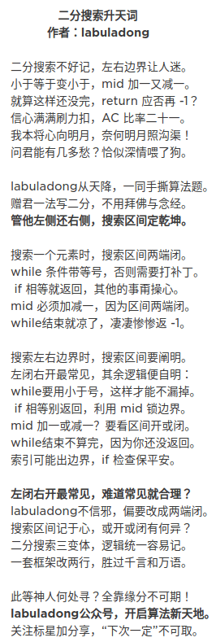

<!-- @import "[TOC]" {cmd="toc" depthFrom=1 depthTo=6 orderedList=false} -->

<!-- code_chunk_output -->

- [1. 双指针](#1-双指针)
  - [快慢指针](#快慢指针)
  - [左右指针](#左右指针)
  - [滑动窗口](#滑动窗口)
    - [题目](#题目)
    - [普通算法框架 (needs == window)](#普通算法框架-needs--window)
    - [其他算法框架（长度相等）](#其他算法框架长度相等)
- [2. Binary Search](#2-binary-search)
  - [寻找一个数](#寻找一个数)
    - [框架](#框架)
  - [寻找左侧边界的二分搜索](#寻找左侧边界的二分搜索)
    - [框架](#框架-1)
  - [寻找右侧边界的二分查找](#寻找右侧边界的二分查找)
  - [总结](#总结)
    - [最基本的二分查找算法](#最基本的二分查找算法)
    - [寻找左侧边界的二分查找](#寻找左侧边界的二分查找)
    - [寻找右侧边界的二分查找](#寻找右侧边界的二分查找-1)
    - [两端都闭](#两端都闭)
  - [题目](#题目-1)
- [3. 题型](#3-题型)
  - [1) O(1) 时间删除/查找数组元素](#1-o1-时间删除查找数组元素)
  - [2) 避开黑名单的随机数](#2-避开黑名单的随机数)
  - [总结](#总结-1)
    - [题目](#题目-2)

<!-- /code_chunk_output -->

# 1. 双指针
- 适用于**链表，子串，数组**
  
## 快慢指针
- 归并，排序，找重点，判断成环

## 左右指针
- 反转数组，二分搜索
  
## 滑动窗口 
- 子串问题
### 题目
- [x] 76
- [x] 567
- [x] 438
- [x] 3
### 普通算法框架 (needs == window)
``` java
/* 滑动窗口算法框架 */
void slidingWindow(string s, string t) {
    unordered_map<char, int> need, window;
    for (char c : t) need[c]++;
    
    int left = 0, right = 0;
    int valid = 0; 
    while (right < s.size()) {
        // c 是将移入窗口的字符
        char c = s[right];
        // 右移窗口
        right++;
        // 进行窗口内数据的一系列更新
        /*
        if (need.count(c)) {
            window[c]++;
            if (window[c] == need[c])
                valid++;
        }
        */
        
        /*** debug 输出的位置 ***/
        printf("window: [%d, %d)\n", left, right);
        /********************/
        
        // 判断左侧窗口是否要收缩
        while (window needs shrink) {
            // d 是将移出窗口的字符
            char d = s[left];
            // 左移窗口
            left++;
            // 进行窗口内数据的一系列更新
            /*
            if (need.count(d)) {
                if (window[d] == need[d])
                    valid--;
                window[d]--;
            }            
            */
            ...
        }
    }
}
```

### 其他算法框架（长度相等）
- Leetcode 567
- 注意这里修改了**左侧窗口收缩**以及**结束**的条件: `right - left >= t.size()`
``` java {highlight=19}
// 判断 s 中是否存在 t 的排列
bool checkInclusion(string t, string s) {
    unordered_map<char, int> need, window;
    for (char c : t) need[c]++;

    int left = 0, right = 0;
    int valid = 0;
    while (right < s.size()) {
        char c = s[right];
        right++;
        // 进行窗口内数据的一系列更新
        if (need.count(c)) {
            window[c]++;
            if (window[c] == need[c])
                valid++;
        }

        // 判断左侧窗口是否要收缩
        while (right - left >= t.size()) {
            // 在这里判断是否找到了合法的子串
            if (valid == need.size())
                return true;
            char d = s[left];
            left++;
            // 进行窗口内数据的一系列更新
            if (need.count(d)) {
                if (window[d] == need[d])
                    valid--;
                window[d]--;
            }
        }
    }
    // 未找到符合条件的子串
    return false;
}
```

# 2. Binary Search
**直接背[两端都闭](#两端都闭)** <br><br>

## 寻找一个数
### 框架
``` java
int binarySearch(int[] nums, int target) {
    int left = 0; 
    int right = nums.length - 1; // 注意

    while(left <= right) {
        int mid = left + (right - left) / 2;
        if(nums[mid] == target)
            return mid; 
        else if (nums[mid] < target)
            left = mid + 1; // 注意
        else if (nums[mid] > target)
            right = mid - 1; // 注意
    }
    return -1;
}
```
1. 为什么 while 循环的条件中是 `<=`，而不是 `<` ？
   `while` 循环什么时候应该终止？**搜索区间为空的时候应该终止**，意味着你没得找了，就等于没找到嘛。<br>
   `while(left <= right)` 的终止条件是 `left == right + 1`，写成区间的形式就是 `[right + 1, right]`，或者带个具体的数字进去 [3, 2]，可见这时候区间为空，因为没有数字既大于等于 3 又小于等于 2 的吧。所以这时候 while 循环终止是正确的，直接返回 -1 即可。<br>  
   `while(left < right)` 的终止条件是 `left == right`，写成区间的形式就是 `[right, right]`，或者带个具体的数字进去 [2, 2]，这时候区间非空，还有一个数 2，但此时 while 循环终止了。也就是说这区间 [2, 2] 被漏掉了，索引 2 没有被搜索，如果这时候直接返回 -1 就是错误的。
   <br>
2. 为什么 `left = mid + 1`，`right = mid - 1`？我看有的代码是 right = mid 或者 left = mid，没有这些加加减减，到底怎么回事，怎么判断？
   
   本算法的搜索区间是两端都闭的，即 [left, right]。那么当我们发现索引 mid 不是要找的 target 时，下一步应该去搜索哪里呢？<br>
    当然是去搜索 [left, mid-1] 或者 [mid+1, right] 对不对？因为 mid 已经搜索过，应该从搜索区间中去除。

## 寻找左侧边界的二分搜索
### 框架
``` java
int left_bound(int[] nums, int target) {
    if (nums.length == 0) return -1;
    int left = 0;
    int right = nums.length; // 注意
    
    while (left < right) { // 注意
        int mid = left + (right - left) / 2;
        if (nums[mid] == target) {
            right = mid;
        } else if (nums[mid] < target) {
            left = mid + 1;
        } else if (nums[mid] > target) {
            right = mid; // 注意
        }
    }

    // target 比所有数都大
    if (left == nums.length) return -1;
    // 类似之前算法的处理方式
    return nums[left] == target ? left : -1; # return -1

    
    return left; # return left idx 
}
```
1. 为什么 while 中是 `<` 而不是 `<=`?

循环的「搜索区间」是 `[left, right)` 左闭右开。`while(left < right)` 终止的条件是 `left == right`，此时搜索区间 `[left, left)` 为空，所以可以正确终止。

## 寻找右侧边界的二分查找
``` java {highlight=15}
int right_bound(int[] nums, int target) {
    if (nums.length == 0) return -1;
    int left = 0, right = nums.length;
    
    while (left < right) {
        int mid = left + (right - left) / 2;
        if (nums[mid] == target) {
            left = mid + 1; // 注意
        } else if (nums[mid] < target) {
            left = mid + 1;
        } else if (nums[mid] > target) {
            right = mid;
        }
    }
    return left - 1; // 注意
}
```

1. 为什么最后返回 `left - 1` 而不像左侧边界的函数，返回 `left`？而且我觉得这里既然是搜索右侧边界，应该返回 right 才对。
   ``` java
   if (nums[mid] == target) {
       left = mid + 1;
       // 这样想: mid = left - 1
   }
   ```
   因为我们对 left 的更新必须是 `left = mid + 1`，就是说 while 循环结束时，`nums[left]` 一定不等于 target 了，而 `nums[left-1]` 可能是 target。

``` java
int right_bound(int[] nums, int target) {
    int left = 0, right = nums.length - 1;
    while (left <= right) {
        int mid = left + (right - left) / 2;
        if (nums[mid] < target) {
            left = mid + 1;
        } else if (nums[mid] > target) {
            right = mid - 1;
        } else if (nums[mid] == target) {
            // 这里改成收缩左侧边界即可
            left = mid + 1;
        }
    }
    // 这里改为检查 right 越界的情况，见下图
    if (right < 0 || nums[right] != target) {
        return -1;
    }
    return right;
```

## 总结

### 最基本的二分查找算法
>因为我们初始化 right = nums.length - 1
所以决定了我们的「搜索区间」是 [left, right]
所以决定了 while (left <= right)
同时也决定了 left = mid+1 和 right = mid-1 <br>
因为我们只需找到一个 target 的索引即可
所以当 nums[mid] == target 时可以立即返回

### 寻找左侧边界的二分查找
>因为我们初始化 right = nums.length
所以决定了我们的「搜索区间」是 [left, right)
所以决定了 while (left < right)
同时也决定了 left = mid + 1 和 right = mid<br>
因为我们需找到 target 的最左侧索引
所以当 nums[mid] == target 时不要立即返回
而要收紧右侧边界以锁定左侧边界

### 寻找右侧边界的二分查找
>因为我们初始化 right = nums.length
所以决定了我们的「搜索区间」是 [left, right)
所以决定了 while (left < right)
同时也决定了 left = mid + 1 和 right = mid<br>
因为我们需找到 target 的最右侧索引
所以当 nums[mid] == target 时不要立即返回
而要收紧左侧边界以锁定右侧边界<br>
又因为收紧左侧边界时必须 left = mid + 1
所以最后无论返回 left 还是 right，必须减一

``` java

int left_bound(int[] nums, int target) {
    if (nums.length == 0) return -1;
    int left = 0;
    int right = nums.length; // 注意
    
    while (left < right) { // 注意
        int mid = left + (right - left) / 2;
        if (nums[mid] == target) {
            right = mid;
        } else if (nums[mid] < target) {
            left = mid + 1;
        } else if (nums[mid] > target) {
            right = mid; // 注意
        }
    }

    // target 比所有数都大
    if (left == nums.length) return -1;
    // 类似之前算法的处理方式
    return nums[left] == target ? left : -1; # return -1
}


int right_bound(int[] nums, int target) {
    if (nums.length == 0) return -1;
    int left = 0, right = nums.length;
    
    while (left < right) {
        int mid = left + (right - left) / 2;
        if (nums[mid] == target) {
            left = mid + 1; // 注意
        } else if (nums[mid] < target) {
            left = mid + 1;
        } else if (nums[mid] > target) {
            right = mid;
        }
    }
    return left - 1; // 注意
}
```
    

### 两端都闭
``` java
int binary_search(int[] nums, int target) {
    int left = 0, right = nums.length - 1; 
    while(left <= right) {
        int mid = left + (right - left) / 2;
        if (nums[mid] < target) {
            left = mid + 1;
        } else if (nums[mid] > target) {
            right = mid - 1; 
        } else if(nums[mid] == target) {
            // 直接返回
            return mid;
        }
    }
    // 直接返回
    return -1;
}

int left_bound(int[] nums, int target) {
    int left = 0, right = nums.length - 1;
    while (left <= right) {
        int mid = left + (right - left) / 2;
        if (nums[mid] < target) {
            left = mid + 1;
        } else if (nums[mid] > target) {
            right = mid - 1;
        } else if (nums[mid] == target) {
            // 别返回，锁定左侧边界
            right = mid - 1;
        }
    }
    // 最后要检查 left 越界的情况
    if (left >= nums.length || nums[left] != target) {
        return -1;
    }
    return left;
}

int right_bound(int[] nums, int target) {
    int left = 0, right = nums.length - 1;
    while (left <= right) {
        int mid = left + (right - left) / 2;
        if (nums[mid] < target) {
            left = mid + 1;
        } else if (nums[mid] > target) {
            right = mid - 1;
        } else if (nums[mid] == target) {
            // 别返回，锁定右侧边界
            left = mid + 1;
        }
    }
    // 最后要检查 right 越界的情况
    if (right < 0 || nums[right] != target) {
        return -1;
    }
    return right;
}
```

## 题目
- [x] :green_heart: 704「Binary Search」
- [x] :yellow_heart: 34「Find First and Last Position of Element in Sorted Array」

# 3. 题型
## 1) O(1) 时间删除/查找数组元素
- 需要满足的operation：
  - 查找：hashmap
  - Insert：list
  - getRandom：list
- 利用 hashmap 记录 index，进行增删改查


## 2) 避开黑名单的随机数

## 总结
1. 如果想高效地，等概率地随机获取元素，就要使用数组作为底层容器。
2. 如果要保持数组元素的紧凑性，可以把待删除元素换到最后，然后 `pop` 掉末尾的元素，这样时间复杂度就是 `O(1)` 了。当然，我们需要额外的哈希表记录值到索引的映射。
3. 对于第二题，数组中含有「空洞」（黑名单数字），也可以利用哈希表巧妙处理映射关系，让数组在逻辑上是紧凑的，方便随机取元素。
### 题目
- [ ] :yellow_heart: 380
- [ ] :heart: 710

